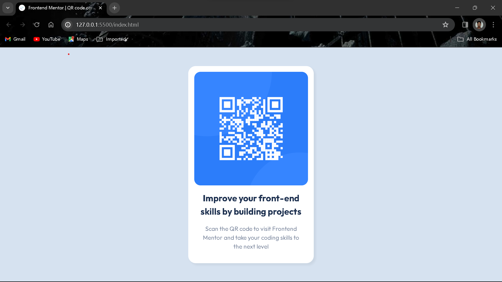

# Frontend Mentor - QR code component solution

This is a solution to the [QR code component challenge on Frontend Mentor](https://www.frontendmentor.io/challenges/qr-code-component-iux_sIO_H). Frontend Mentor challenges help you improve your coding skills by building realistic projects. 

## Table of contents

- [Overview](#overview)
  - [Screenshot](#screenshot)
  - [Links](#links)
- [My process](#my-process)
  - [Built with](#built-with)
  - [What I learned](#what-i-learned)
- [Author](#author)
- [Acknowledgments](#acknowledgments)

## Overview

### Screenshot

### Links

- Solution URL: [click here](https://github.com/Jithin-b-p/qr-code-component-main)
- Live Site URL: [click here](https://jithin-b-p.github.io/qr-code-component-main/)

## My process

### Built with

- CSS custom properties
- Flexbox

### What I learned

Used this section to recap over some important html elements and css properties.

## Author

- [Jithin B P]()
- Frontend Mentor - [@Jithin-b-p](https://www.frontendmentor.io/profile/Jithin-b-p)

## Acknowledgments

Thanks to everyone who share there knowledge to the world..🎉👏😊
